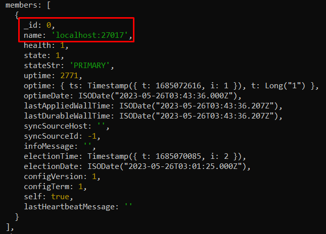
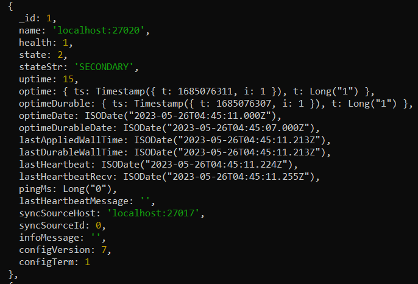
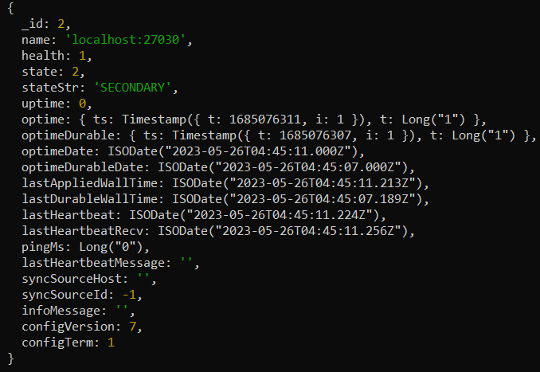

# SETUP INICIAL Y PUESTA EN MARCHA DEL REPLICA SET LOCAL (Windows)


**Abrir una CMD Admin (CMD-1)**


## Setup de Mongo y del Ambiente


Tendremos un directorio raíz para toda la implementación. En este caso, se llamará _ReplicaSet Cluster_ y estará directamente en el disco _C_. Moverse a él:
```bat
cd C:\ReplicaSet Cluster
```


Crear estos subdirectorios:
```bat
mkdir .\data1\db .\data1\log .\data1\config

mkdir .\data2\db .\data2\log .\data2\config
```


## Iniciar el Nodo principal


Detener el servicio _MongoDB Server (MongoDB)_. Ir al directorio raíz y ejecutar el daemon de Mongo con los siguientes parámetros:
```bat
mongod --dbpath "C:\Program Files\MongoDB\Server\6.0\data" --logpath "C:\Program Files\MongoDB\Server\6.0\log\mongod.log" --port 27017 --storageEngine=wiredTiger --journal --replSet replicaSA
```
Este comando inicia el proceso que acabamos de detener pero con los parámetros que se ponen ahí. La consola debe quedar "bloqueada".


**Abrir otra CMD Admin (CMD-2) e ir al directorio raíz**


Ejecutar el shell de MongoDB en el puerto _27017_
```bat
mongosh --port:27017
```
Debería entrar en modo Mongo la consola, sale algo como _"test>"_ al inicio de la línea de comandos.


_Aquí, al intentar ejecutar un **"show dbs"** debería salir un error._


El primer comando es el _Replica Set Config_. Básicamente le dice a Mongo que el RS que habíamos creado antes (_replicaSA_) contiene ahora un miembro (con _\_id:0_) que está alojado en _localhost:27017_. El segundo comando ejecuta lo que definimos en el primero:
```bat
rsconf={_id:"replicaSA",members:[{_id:0,host:"localhost:27017"}]}

rs.initiate(rsconf)
```
Luego de ejecutar eso, hay que dar _ENTER_ una vez más en la línea vacía para que esta cambie de _replicaSA [direct: other] test>_ a _replicaSA [direct: primary] test>_. Nótese que pasó de _other_ a _primary_.


_Ahora, ejecutar un **"show dbs"** debería mostrar algo._


## Iniciar los Nodos Secundarios y Replicar Data

### Nodo Secundario \#1:


**Abrir otra CMD Admin (CMD-3) e ir al directorio raíz**


Ahora, vamos a volver a ejecutar aquí el daemon, pero ahora con valores de _dbpath_, _logpath_ y _port_ diferentes:
```bat
mongod --dbpath "C:\ReplicaSet Cluster\data1\db" --logpath "C:\ReplicaSet Cluster\data1\log\mongod.log" --port 27020 --storageEngine=wiredTiger --journal --replSet replicaSA
```


### Nodo Secundario \#2:


**Abrir otra CMD Admin (CMD-4) e ir al directorio raíz**


La misma idea del nodo secundario \#1:
```bat
mongod --dbpath "C:\ReplicaSet Cluster\data2\db" --logpath "C:\ReplicaSet Cluster\data2\log\mongod.log" --port 27030 --storageEngine=wiredTiger --journal --replSet replicaSA
```


## Agregar los nodos al cluster


**Volver a CMD-2**

Si en este momento escribimos el comando _rs.status()_, va a salirnos la información del cluster. Lo importante es que en _members_ solo va a haber uno. Solo va a estar el nodo principal que añadimos al ejecutar el _rsconfig_ anteriormente.





Entonces toca agregar los otros dos nodos. Se usa este comando; Simplemente agrega lo que está en esos hosts (que es el nodo secundario \#1 y \#2, respectivamente):
```bat
rs.add("localhost:27020")

rs.add("localhost:27030")
```

Ahora, si ejecutamos otra vez _rs.status()_ deberían aparecer los 3 nodos. El primario que ya estaba y los dos secundarios que acabamos de agregar:





## PASO NO SIEMPRE NECESARIO: Habilitación de Maestro-Esclavo


**Abrir otra CMD Admin (CMD-5) e ir al directorio raíz**


Entramos a la MongoDB Shell del Nodo Secundario \#2:
```bat
mongosh --port 27020
```

Si usamos _show dbs_, a veces sale un error diciendo que no está habilitada la relación Maestro-Esclavo en estos nodos secundarios. Se soluciona con este comando:
```bat
rs.slaveOk()
```

Y para el otro nodo secundario se hace lo mismo.


## Crear la Base de Datos


**Volver a CMD-2**


Entramos a la base de datos que se llamará _SistemaAcademico_:
```bat
use SistemaAcademico
```


Creamos una nueva colección _Prueba_:
```bat
db.Prueba.insert({"name":"dato de prueba <:"})
```


## Conexión con MongoDBCompass

Es posible también conectarse a los nodos del cluster a través de MongoDBCompass. Para ello, basta con escribir un string de conexión como el siguiente:
```
mongodb://localhost:27017/
```


---

Anexo basado en el tutorial de: https://www.youtube.com/watch?v=91PCBRJxkh0